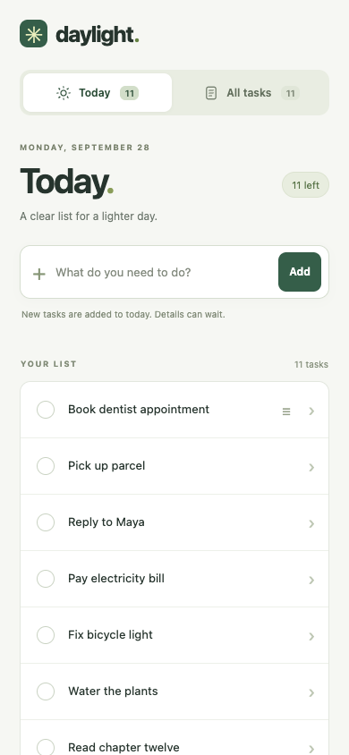
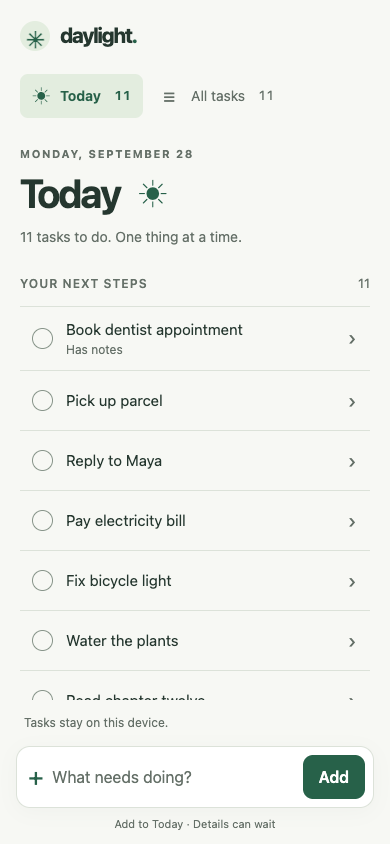

# Paired Rendered Todo Benchmark — 2026-09-28

Two fresh Codex worker contexts generated the same Todo brief, one without AI Design Rules and one with the current knowledge graph. Both received the same seed data, technical envelope, tools, and ten-minute maximum. This directory stores the frozen source, prompts, context, forty screenshots, runtime observations, and an internal evaluation.

**Result:** baseline **7.42/10**, AI Design Rules **7.67/10**, a **+0.25** difference in this evaluator's rubric average. The result is mixed: larger touch targets and more stable error layout accompany a longer keyboard path to capture. Visual hierarchy scored equally. This one unblinded pair does not establish a general quality gain.

- [Full evaluation and findings](EVALUATION.md)
- [Shared setup and limitations](common/setup.json)
- [Unchanged common brief](common/brief.md)
- [Shared task data](common/seed.json)
- [Frozen knowledge patch](common/knowledge.patch) and [file hashes](common/knowledge-files.json)
- [Baseline output](baseline/generated-output.md) and [rules-assisted output](ai-design-rules/generated-output.md)
- [Measured mobile geometry](layout-metrics.json)

| Baseline | AI Design Rules |
| --- | --- |
|  |  |

## Inspect The Frozen Apps

From this directory:

```sh
python3 -m http.server 4183 --bind 127.0.0.1
```

Open `http://127.0.0.1:4183/baseline/` and `http://127.0.0.1:4183/ai-design-rules/`. Each app has its own storage key. The apps deliberately treat September 28, 2026 as Today and use simulated local saves.

## Reproduce The Browser Checks

Use Playwright CLI with a locally installed Chrome. The recorded run used Headless Chrome 153.0.8010.53, en-GB locale, light scheme, CSS pixel scale 1. Run the CLI from this directory so screenshot paths resolve correctly. The scripts will overwrite this run's screenshots if executed here; copy the directory before rerunning.

```sh
playwright-cli -s=todo-replay open http://127.0.0.1:4183/baseline/ --browser chrome
playwright-cli -s=todo-replay snapshot
playwright-cli -s=todo-replay --json run-code --filename capture-baseline.js
playwright-cli -s=todo-replay goto http://127.0.0.1:4183/ai-design-rules/
playwright-cli -s=todo-replay snapshot
playwright-cli -s=todo-replay --json run-code --filename capture-ai-design-rules.js
playwright-cli -s=todo-replay --json run-code --filename layout-probe.js
playwright-cli -s=todo-replay close
```

The runtime files contain the parsed `result` returned by these scripts. Screenshots cover mobile and desktop default, empty, saving, failed save, successful retry, completed task, details, reduced-motion details, keyboard focus, and validation. Interaction results additionally cover edit failure/retry, persistence, immediate dialog dismissal, and focus/scroll restoration. No frozen application code was changed after generation.

## Provenance And Limits

Knowledge input: commit `3d9a6a70c47b7008a47dafd24a4aeef2855b07f2` plus the saved pre-generation patch. The two workers used `fork_turns=none`, the same worker role and inherited model configuration, with no model/reasoning override. Actual generation times were 7m09s and 7m34s within the same ten-minute cap. Tools were restricted by prompt to filesystem access and shell syntax checks; both generators reported no browser, network, sibling output, or existing implementation access.

The exact backend model identifier and sampling settings were not exposed. Isolation was prompt-enforced on a shared host, not OS-enforced. The parent evaluator knew the conditions and had authored the tested knowledge changes. This is neither blinded nor independent evaluation. No physical mobile keyboard, screen reader, cross-browser, formal contrast, or performance audit was performed. No rule or pattern maturity was promoted.

Transient machine paths in prompt/notes artifacts were replaced by `${RUN_ROOT}` and `${KNOWLEDGE_ROOT}`; all other prompt text was preserved. Metadata records both original and stored prompt hashes. Raw application bytes and screenshots were not modified. The attempted preliminary `spark_explorer` audit failed because that model was unavailable; it generated no benchmark output and is not one of the measured runs.
